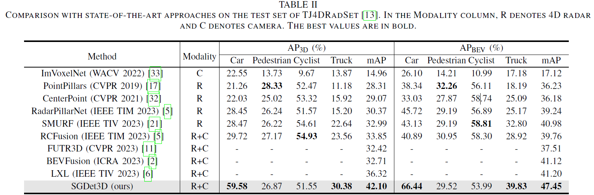

# DeepRCBEV: Deep Interaction for 4D Radar-Camera Fusion

## 🚀 News

- **2024.9.xx** code released
- **2024.9.xx** arXiv preprint released

## Abstract

4D millimeter-wave radar has gained attention as an emerging sensor for autonomous driving in recent years. However, existing 4D radar and camera fusion models often fail to fully exploit complementary information within each modality and lack deep cross-modal interactions. To address these issues, we propose a novel 4D radar and camera fusion method, named SGDet3D, for 3D object detection. Specifically, we first introduce a dual-branch fusion module that employs geometric depth completion and semantic radar PillarNet to comprehensively leverage geometric and semantic information within each modality. Then we introduce an object-oriented attention module that employs localization-aware cross-attention to facilitate deep interactions across modalites by allowing queries in bird’s-eye view (BEV) to attend to interested image tokens. We validate our SGDet3D on the TJ4DRadSet and View-of-Delft (VoD) datasets. Experimental results demonstrate that SGDet3D effectively fuses 4D radar data and camera image and achieves state-of-the-art performance.

## Method


Architecture of our SGDet3D neural network. (a) The feature extraction module extract radar and image features. (b) The dual-branch fusion module fully leverages rich radar geometry for image branch and rich image semantics for radar branch, ultimately lifting the features into the unified BEV space. (c) The object-oriented attention module uses cross-attention to further enhance the featurization of the cross-modal BEV queries by deeply interacting with interested image tokens. (d) The object detection head. Dashed line represents the deep utilization of cross-modal information.

## Quantitative Results




## Getting Started

step 1. Refer to [install.md](./docs/install.md) to install the environment.

step 2. Refer to [dataset.md](./docs/dataset.md) to prepare SemanticKITTI and KITTI360 dataset.

step 3. Refer to [train_and_eval.md](./docs/train_and_eval.md) for training and evaluation.

## Model Zoo

We provide the pretrained weights on SemanticKITTI and KITTI360 datasets, reproduced with the released codebase.


|                      Dataset                       |    Backbone    |        IoU         |        mIoU        |                        Model Weights                         |                        Training Logs                         |
| :------------------------------------------------: | :------------: | :----------------: | :----------------: | :----------------------------------------------------------: | :----------------------------------------------------------: |
| [SemanticKITTI](configs/semantickitti_CGFormer.py) | EfficientNetB7 | 44.41, 45.99 (val) | 16.63, 16.89 (val) | [Link](https://github.com/pkqbajng/CGFormer/releases/download/v1.0/CGFormer_semantickitti.ckpt) | [Link](https://github.com/pkqbajng/CGFormer/releases/download/v1.0/CGFormer_semantickitti_logs.zip) |
|   [KITTI360](configs/semantickitti_CGFormer.py)    | EfficientNetB7 |       48.07        |       20.05        | [Link](https://github.com/pkqbajng/CGFormer/releases/download/v1.0/CGFormer_kitti360.ckpt) | [Link](https://github.com/pkqbajng/CGFormer/releases/download/v1.0/CGFormer_kitti360_logs.zip) |

## Acknowledgement

Many thanks to these exceptional open source projects:
- [BEVFormer](https://github.com/fundamentalvision/BEVFormer)
- [DFA3D](https://github.com/IDEA-Research/3D-deformable-attention.git)
- [mmdet3d](https://github.com/open-mmlab/mmdetection3d)
- [VoxFormer](https://github.com/NVlabs/VoxFormer.git)
- [OccFormer](https://github.com/zhangyp15/OccFormer.git)
- [CGFormer](https://github.com/pkqbajng/CGFormer)

As it is not possible to list all the projects of the reference papers. If you find we leave out your repo, please contact us and we'll update the lists.

## Bibtex

If you find our work beneficial for your research, please consider citing our paper and give us a star:

```
@
```

If you encounter any issues, please contact shawnnnkb@zju.edu.cn.

## To do

- Visualization scripts
